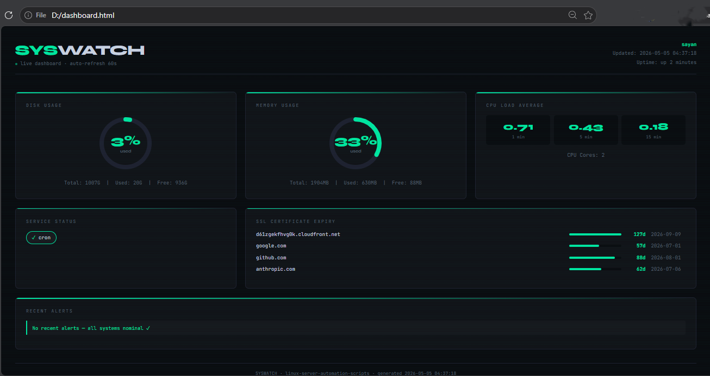

# 🖥️ Linux Server Automation Scripts


> A production-grade Linux server automation toolkit featuring backup management, real-time health monitoring, SSL certificate tracking, firewall auditing, cloud storage integration, and an HTML dashboard — all with Telegram alerts.

---

## 📸 Dashboard Preview

```
🖥️  SYSWATCH — Live Server Dashboard
━━━━━━━━━━━━━━━━━━━━━━━━━━━━━━━━━━━━
  Disk: 3% ██░░░░░░░░  RAM: 31% ███░░░░░░░
  Load: 0.06 (1m) | Cores: 2 | Uptime: 3 days
  SSL: d61zgekfhvg0k.cloudfront.net → 127 days ✓
  Services: cron ✓ | nginx ✓
  Alerts: ✓ All systems nominal

```

## 📸 Dashboard Preview




---

## 📁 Project Structure

```
linux-server-automation-scripts/
├── 📜 backup.sh               # Folder + MySQL/PostgreSQL backup
├── 📜 health_check.sh         # Disk, memory, CPU, service monitor
├── 📜 ssl_checker.sh          # SSL certificate expiry checker
├── 📜 firewall_audit.sh       # UFW + open ports security audit
├── 📜 s3_backup.sh            # AWS S3 cloud backup upload
├── 🐍 linux_admin.py          # Log analysis + user/group management
├── 🐍 generate_dashboard.py   # HTML health dashboard generator
├── 🐳 Dockerfile              # Containerized environment
├── 🐳 docker-entrypoint.sh    # Docker command router
├── 🐳 docker-compose.yml      # Multi-service orchestration
├── 🧪 tests/
│   └── test_linux_admin.py    # 22 unit tests (pytest)
├── ⚙️  .github/
│   └── workflows/
│       └── lint.yml           # CI/CD: ShellCheck + Pylint
└── 📖 README.md
```

---

## ✨ Features

| Script | What it does |
|--------|-------------|
| `backup.sh` | Compresses `/etc`, `/home`, `/var/www` into `.tar.gz`, dumps MySQL/PostgreSQL, generates SHA-256 checksums, auto-prunes old backups |
| `health_check.sh` | Monitors disk, RAM, CPU load, systemd services, zombie processes — sends Telegram alert on issues |
| `ssl_checker.sh` | Checks SSL certificate expiry for multiple domains, alerts 30 days before expiry |
| `firewall_audit.sh` | Audits UFW status, scans open ports, detects suspicious ports, reports failed login attempts |
| `s3_backup.sh` | Uploads backups to AWS S3 with deduplication, STANDARD_IA storage class, 30-day retention |
| `linux_admin.py` | Analyzes log files by level (ERROR/WARN/INFO), manages users and groups via CLI |
| `generate_dashboard.py` | Generates a live HTML dashboard with gauges, SSL countdown, and alert history |

---

## 🚀 Quick Start

### 1. Clone the repo

```bash
git clone https://github.com/Ssayan1/linux-server-automation-scripts.git
cd linux-server-automation-scripts
```

### 2. Make scripts executable

```bash
chmod +x backup.sh health_check.sh ssl_checker.sh firewall_audit.sh s3_backup.sh
```

### 3. Run health check

```bash
sudo ./health_check.sh
```

### 4. Run with Docker

```bash
docker build -t linux-automation .
docker run --rm linux-automation help
```

---

## 📋 Script Usage

### 🗄️ backup.sh — Backup Folders & Databases

```bash
# Basic run (backs up /etc, /home, /var/www)
sudo ./backup.sh

# Dry run — preview without writing
sudo ./backup.sh --dry-run

# With MySQL
MYSQL_ENABLED=true MYSQL_USER=root MYSQL_PASS=secret sudo ./backup.sh

# With PostgreSQL
PSQL_ENABLED=true PSQL_DATABASES="myapp" sudo ./backup.sh
```

**Environment Variables:**

| Variable | Default | Description |
|----------|---------|-------------|
| `BACKUP_ROOT` | `/var/backups/server` | Backup destination |
| `RETENTION_DAYS` | `7` | Days to keep local backups |
| `MYSQL_ENABLED` | `false` | Enable MySQL dumps |
| `PSQL_ENABLED` | `false` | Enable PostgreSQL dumps |

---

### 🏥 health_check.sh — Server Health Monitor

```bash
# Basic run
sudo ./health_check.sh

# With email alerts
sudo ./health_check.sh --email ops@company.com

# Custom log file
sudo ./health_check.sh --log /var/log/myserver.log
```

**Thresholds:**

| Metric | Warning | Critical |
|--------|---------|----------|
| Disk usage | 80% | 90% |
| Memory usage | 80% | 95% |
| CPU load (1m) | 2.0 | 5.0 |

**Exit codes:** `0` = healthy · `1` = warnings · `2` = critical

---

### 🔐 ssl_checker.sh — SSL Certificate Monitor

```bash
sudo ./ssl_checker.sh
```

Checks domains defined in the `DOMAINS` array and sends Telegram alerts when certificates expire within 30 days (warning) or 7 days (critical).

---

### 🔥 firewall_audit.sh — Security Audit

```bash
sudo ./firewall_audit.sh
```

Checks:
- UFW firewall active/inactive status
- All open ports against a whitelist
- Known suspicious ports (4444, 1337, 31337, 6666)
- Active network connections
- Failed SSH login attempts

---

### ☁️ s3_backup.sh — AWS S3 Upload

```bash
# Configure AWS first
aws configure

# Upload latest backup
sudo ./s3_backup.sh
```

Uploads to `STANDARD_IA` storage class (60% cheaper than standard). Auto-prunes backups older than 30 days.

---

### 🐍 linux_admin.py — Log Analysis & User Management

```bash
# Analyze logs
python3 linux_admin.py analyze /var/log/syslog
python3 linux_admin.py analyze /var/log/nginx/error.log --level WARNING --tail 1000 --report report.txt

# User management (requires sudo)
sudo python3 linux_admin.py adduser alice --groups sudo,docker --comment "Alice Smith"
sudo python3 linux_admin.py addgroup developers --gid 1500
sudo python3 linux_admin.py usermod alice --add-groups developers

# List users & groups
python3 linux_admin.py listusers --min-uid 1000
python3 linux_admin.py listgroups
```

---

### 📊 generate_dashboard.py — HTML Dashboard

```bash
# Generate dashboard
python3 generate_dashboard.py --output /tmp/dashboard.html

# Open in browser (WSL)
cp /tmp/dashboard.html /mnt/c/Users/YourName/Desktop/dashboard.html
```

Dashboard auto-refreshes every 60 seconds and shows disk/memory gauges, CPU load, SSL expiry, service status, and recent alerts.

---

## 🐳 Docker Usage

```bash
# Build
docker build -t linux-automation .

# Available commands
docker run --rm linux-automation help
docker run --rm linux-automation health
docker run --rm linux-automation ssl
docker run --rm linux-automation test
docker run --rm linux-automation firewall
docker run --rm linux-automation dashboard
docker run --rm linux-automation all

# Admin tool
docker run --rm linux-automation admin listusers
docker run --rm linux-automation admin analyze /var/log/syslog

# Mount host logs
docker run --rm -v /var/log:/var/log linux-automation health
```

---

## ⏰ Cron Automation

```bash
sudo crontab -e
```

```cron
# Backup every night at 2 AM
0 2 * * * /home/user/linux-server-automation-scripts/backup.sh

# Upload to S3 at 2:30 AM
30 2 * * * /home/user/linux-server-automation-scripts/s3_backup.sh

# Health check every 15 minutes
*/15 * * * * /home/user/linux-server-automation-scripts/health_check.sh

# SSL check every day at 9 AM
0 9 * * * /home/user/linux-server-automation-scripts/ssl_checker.sh

# Firewall audit every hour
0 * * * * /home/user/linux-server-automation-scripts/firewall_audit.sh

# Dashboard refresh every 5 minutes
*/5 * * * * python3 /home/user/linux-server-automation-scripts/generate_dashboard.py
```

---

## 📱 Telegram Alerts Setup

1. Open Telegram → search **@BotFather** → send `/newbot`
2. Save the token it gives you
3. Send a message to your bot, then get your chat ID:
   ```bash
   curl -s "https://api.telegram.org/botYOUR_TOKEN/getUpdates" | python3 -c \
   "import sys,json; u=json.load(sys.stdin)['result']; print(u[-1]['message']['chat']['id'])"
   ```
4. Add to each script:
   ```bash
   TELEGRAM_TOKEN="your_token_here"
   TELEGRAM_CHAT_ID="your_chat_id"
   TELEGRAM_ENABLED=true
   ```

---

## 🧪 Running Tests

```bash
# Install pytest
pip install pytest --break-system-packages

# Run all 22 tests
python3 -m pytest tests/ -v

# Run in Docker
docker run --rm linux-automation test
```

```
22 passed in 0.05s ✅
```

---

## ⚙️ Requirements

| Script | Requirements |
|--------|-------------|
| `backup.sh` | bash ≥ 4, tar, gzip; mysqldump (MySQL); pg_dump (PostgreSQL) |
| `health_check.sh` | bash ≥ 4, systemctl, bc, df, free |
| `ssl_checker.sh` | bash ≥ 4, openssl, curl |
| `firewall_audit.sh` | bash ≥ 4, ufw, netstat, ss |
| `s3_backup.sh` | AWS CLI v2, configured credentials |
| `linux_admin.py` | Python 3.8+, stdlib only |
| `generate_dashboard.py` | Python 3.8+, stdlib only |

---

## 🔒 Security Notes

- Never commit AWS credentials or Telegram tokens to Git
- Add `.env` to `.gitignore`
- Use IAM roles with minimum required permissions for S3
- Rotate tokens regularly

---

## 📄 License

MIT License — feel free to use, modify, and distribute.

---

## 👨‍💻 Author

**Sayan** — [@Ssayan1](https://github.com/Ssayan1)

Portfolio: [d61zgekfhvg0k.cloudfront.net](https://d61zgekfhvg0k.cloudfront.net)

---

⭐ **Star this repo if you found it useful!**
